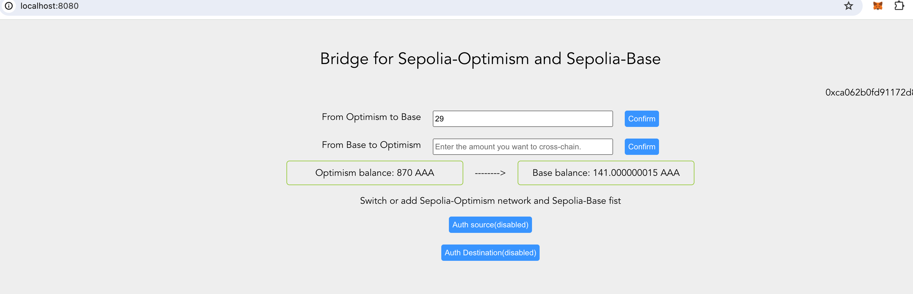

### Project title
A bridge demo for Polymer

### Team members
    Jaycelv

### Project Overview
I deployed a bridge contract on both the source chain and the target chain. When a user sends a token on the source chain, they can receive it on the target chain.
### Run-book
1. Install dependens and start the frontend page
```
npm install && npm run serve
```
2. See http://localhost:8080/
2. Import wallet by private key, add Op and Base chain
```
Private key: 3e4bde571b86929bf08e2aaad9a6a1882664cd5e65b96fff7d03e1c4e6dfa15c
```
3. Add erc20 token to op and base with metamask
    op: 0x7736dF337A660B58b57D114e45C2327825fb6123
    base: 0x3D82d3C85Dd36a660B7AA5dFdd02cC850cF35400
4. Use Metamask add ERC-20 token(contract address: 0x249A61C6b439c0e5feE8164292D86Da6b5f6D809)

5. Connect wallet and send transaction, signature
### Resources Used
- vue.js
- hardhat
- bignumber.js
- web3.js
- @open-ibc/vibc-core-smart-contracts
### Challenges Faced
Writing smart contract code is simple, it's just hair-raising.
### What We Learned

### Future Improvements
In the future, I will refactor the smart contract code, remove unnecessary demo code, integrate the bridge and ERC20 into one contract, and improve the UI.

### Testnet interaction
Optimism: https://optimism-sepolia.blockscout.com/address/0x4e228D691c5A5608EF05666924F9bC49a933D41F?tab=internal_txns
Base: https://base-sepolia.blockscout.com/address/0x3Ab9640a577331afb5df06EDbb09Da517a072be1?tab=internal_txns


### PortAddress
Op: 0x4e228D691c5A5608EF05666924F9bC49a933D41F
Base: 0x3Ab9640a577331afb5df06EDbb09Da517a072be1
 

### Licence
[Apache 2.0](LICENSE)


